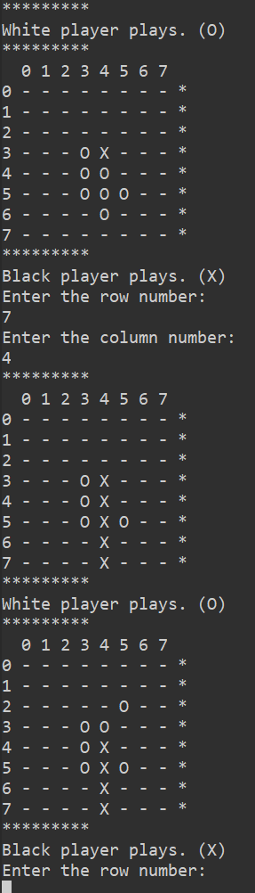

# Othello Game

Information about the game: https://en.wikipedia.org/wiki/Reversi

__An instance of a match__

##How to run on cmd
-Compile all the .java files with the command: javac *.java
-Run the MainApp with the command: java MainApp
-Follow the in-game instructions to play.
-Enjoy!